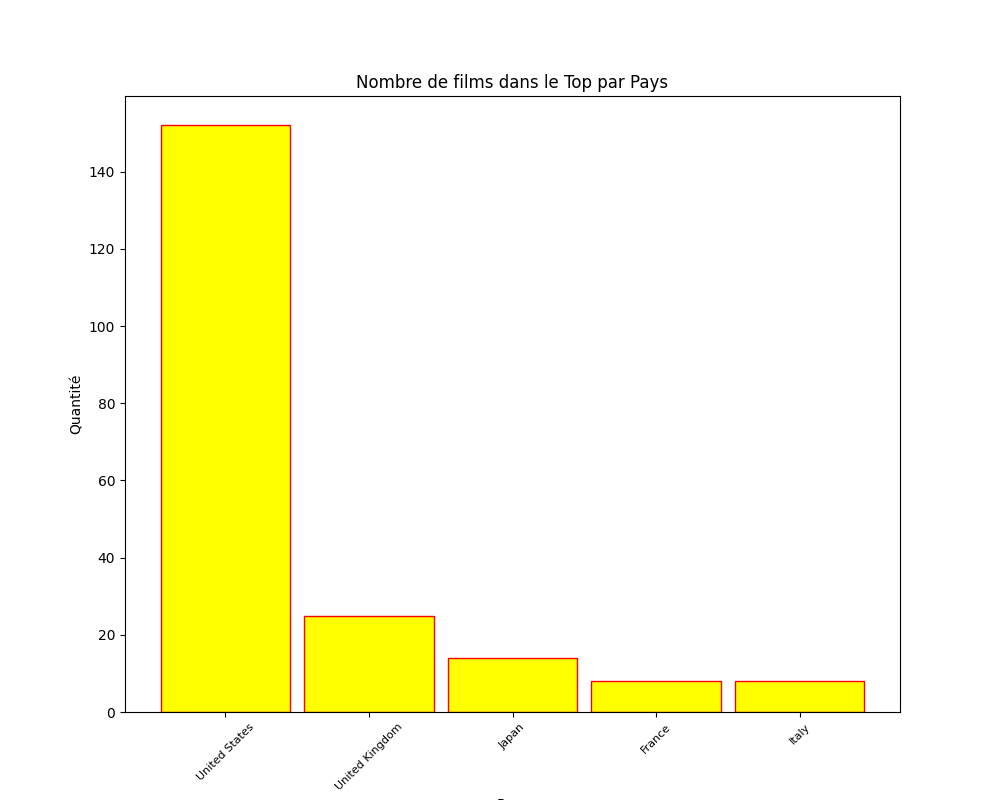

# Extractions de données IMDB
Ce programme :
    recherche sur le site IMDB les meilleurs films de tous les temps, 
    Les enregistre dans un fichier CSV 
    Crée un graphique qui montre le nombre de meilleurs films par dizaine d'années
    Appelle une api pour avoir les informations des films
    Crée un graphique des 5 pays avec le plus de films dans le Top

## Dépendances
    Urllib
    Pandas
    BeautifulSoup
    Matplotlib
    re
    request
    Wordcloud

## Utilisation
Exécutez le script et il commencera à chercher les 250 meilleures films pour les mettre dans un fichier de type CSV.

## Image

Les mots les plus frequemment utilisés dans les titres de films

