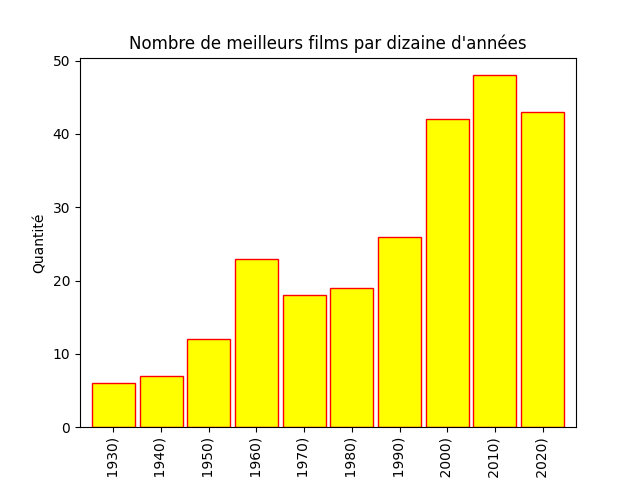

# Extractions de données IMDB
Ce programme recherche sur le site IMDB les meilleurs films de tous les temps, les enregistre dans un fichier CSV et crée un graphique qui montre le nombre de meilleurs films par dizaine d'années

## Dépendances
    Urllib
    Pandas
    BeautifulSoup
    Matplotlib

## Utilisation
Exécutez le script et il commencera à chercher les 250 meilleures films pour les mettre dans un fichier de type CSV.

## Image

